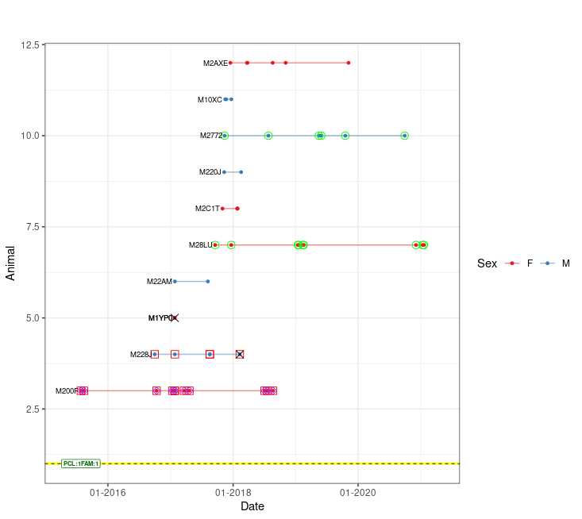
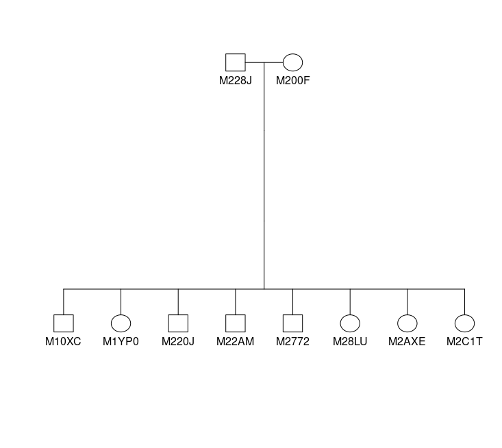
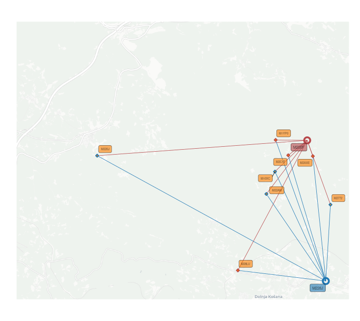
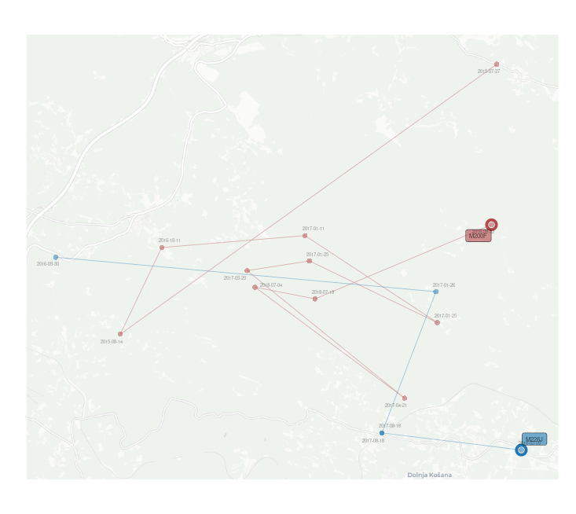

# wpeR

**w**ild **p**edigree **e**xplorer**R** is an R package designed to
simplify the analysis of wild pedigree data. The package was primarily
developed to work with pedigree data generated by
[COLONY2](https://www.zsl.org/about-zsl/resources/software/colony)
pedigree reconstruction software. However, it can also accommodate
pedigree data from other sources. By combining the reconstructed
pedigree with genetic sample metadata, wpeR creates visual and tabular
representations of the pedigree, allowing the user to interpret the
pedigree in spatial and temporal terms. The main goal of the package is
to provide an efficient solution for the analysis of complex wild
pedigree data and to help the user to gain valuable insights into
genetic relationships within wild animal populations.

## Installation

    devtools::install_github("GR3602/wpeR")

## Key Features

- Pedigree import and formatting
- Individual observation timeframe identification
- Family organization
- Temporal pedigree visualization
- Geographic pedigree visualization and GIS output
- Integration with other R packages

## Input Data

The wpeR package requires two main input datasets for analysis:
**Pedigree** and **Genetic samples metadata**.

## Basic workflow

| Function   call   order | Function | Description |
|:--:|:--:|----|
| 1a | *get_colony()* | Organizes COLONY2 output |
| 1b | *get_ped()* | Organizes pedigree data |
| 2 | *anim_timespan()* | Get dates of individuals first and last sample |
| 3 | *org_fams()* | Organizes animals into families and expands pedigree data |
| 4 | *plot_table()* | Prepares pedigree data for plotting and spatial representation |
| 5.1 | *ped_satplot()* | Temporal plot of pedigree |
| 5.2 | *ped_spatial()* | Get files for spatial representation of pedigree |

    ####DATA PREPARATION####
    # Define the path to the pedigree data file.
    path <- paste0(system.file("extdata", package = "wpeR"), "/wpeR_samplePed")

    # Retrieve the pedigree data from the get_colony function.
    ped_colony <- get_colony(path, sampledata, rm_obsolete_parents = TRUE, out = "FamAgg")

    # Get animal timespan data using the anim_timespan() function.
    animal_ts <- anim_timespan(wolf_samples$AnimalRef,
                               wolf_samples$Date,
                               wolf_samples$SType,
                               dead = c("Tissue"))

    # Add animal timespan to the sampledata
    sampledata <- merge(wolf_samples, animal_ts, by.x = "AnimalRef", by.y = "ID", all.x = TRUE)

    # Organize families and expand pedigree data using the org_fams function.
    ## families data frame
    fams <- org_fams(ped_colony, sampledata, output = "fams")
    ## extended pedigree data frame
    ped <- org_fams(ped_colony,sampledata, output = "ped")

    # The example show just one family 
    ## Prepare data for plotting.
    pt <- plot_table(plot_fams = 1,
                     org_tables$fams,
                     org_tables$ped,
                     sampledata,
                     deadSample = c("Tissue"))
                     

    ####VISUALIZATION####                 
    ## Get a temporal pedigree plot.
    ped_satplot(plottable = pt)

**EXAMPLE** Visualization using
[`kinship2`](https://CRAN.R-project.org/package=kinship2) package

    # optional pedigre plot pedigree plot from kinship2
    ### extract parent codes
    parents1 = strsplit(fams[fams$FamID == 1,]$parents, "_")[[1]]
    ### filter the family from pedigre
    Fam1 = ped[(ped$FamID == 1 | ped$id %in% parents1),]
    ### plot using kinship2 
    plot(kinship2::pedigree(Fam1$id, Fam1$father, Fam1$mother, Fam1$sex))

    ## Create spatial files
    <!-- ps <- ped_spatial(pt) -->
    summary(ps)

<table style="border-collapse: collapse; width: 100%; background-color: white;">

<thead>

<tr>

<th colspan="2">

Object Name
</th>

<th>

Description
</th>

</tr>

</thead>

<tbody>

<!-- Rpoints -->

<tr>

<td>

mother…
</td>

<td rowspan="3">

Rpoints
</td>

<td rowspan="3">

POINT object representing reference samples of each animal. Reference
sample for parents is their first sample, reference sample for the
offspring is their last sample within the user defined time frame.
</td>

</tr>

<tr>

<td>

father…
</td>

</tr>

<tr>

<td>

offspring…
</td>

</tr>

<!-- MovePoints -->

<tr>

<td>

mother…
</td>

<td rowspan="3">

MovePoints
</td>

<td rowspan="3">

POINT object representing all samples of a particular animal.
</td>

</tr>

<tr>

<td>

father…
</td>

</tr>

<tr>

<td>

offspring…
</td>

</tr>

<!-- Lines -->

<tr>

<td>

maternity…
</td>

<td rowspan="2">

Lines
</td>

<td rowspan="2">

LINESTRING object connecting reference samples of mothers or fathers
with reference samples of their offspring.
</td>

</tr>

<tr>

<td>

paternity…
</td>

</tr>

<!-- MoveLines -->

<tr>

<td>

mother…
</td>

<td rowspan="3">

MoveLines
</td>

<td rowspan="3">

LINESTRING object connecting all samples of an individual in
chronological order, showcasing the movement or changes in location over
time for the specific animal.
</td>

</tr>

<tr>

<td>

father…
</td>

</tr>

<tr>

<td>

offspring…
</td>

</tr>

<!-- MovePolygon -->

<tr>

<td>

mother…
</td>

<td rowspan="2">

MovePolygon
</td>

<td rowspan="2">

POLYGON object representing a convex hull that encloses all the samples
of an individual. It provides a graphical representation of the spatial
extent or range covered by the animal based on its sample locations.
</td>

</tr>

<tr>

<td>

father…
</td>

</tr>

</tbody>

</table>

 

**EXAMPLE** Using spatial files together with
[`ggplot2`](https://CRAN.R-project.org/package=ggplot2),
[`basemaps`](https://CRAN.R-project.org/package=basemaps) and
[`ggsflabel`](https://github.com/yutannihilation/ggsflabel) for spatial
visualization.

|  |
|:--:|
| *Spatial representation using mother/father/offspringRpoints and maternety/paternitylines* |

|                             |
|:------------------------------------------------------------------------:|
| *Spatial representation using mother/fatherRpoints/MovePoints/MoveLines* |
