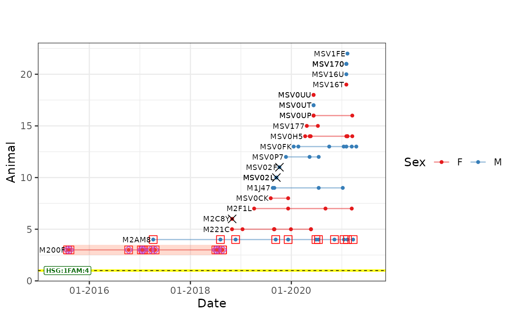
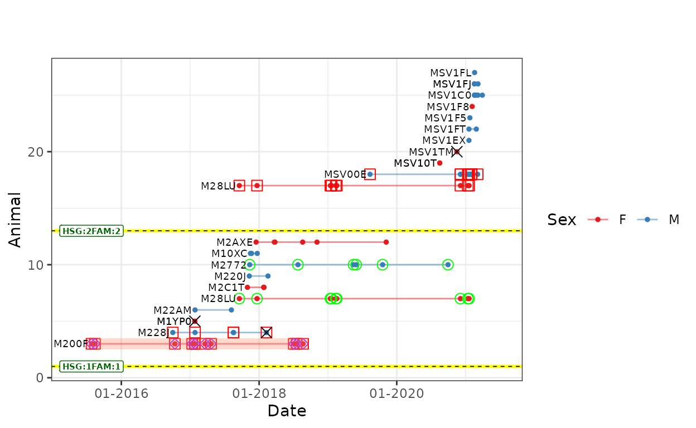
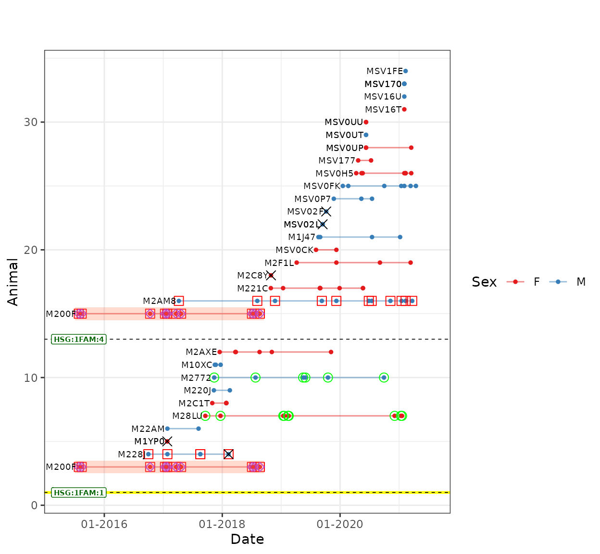
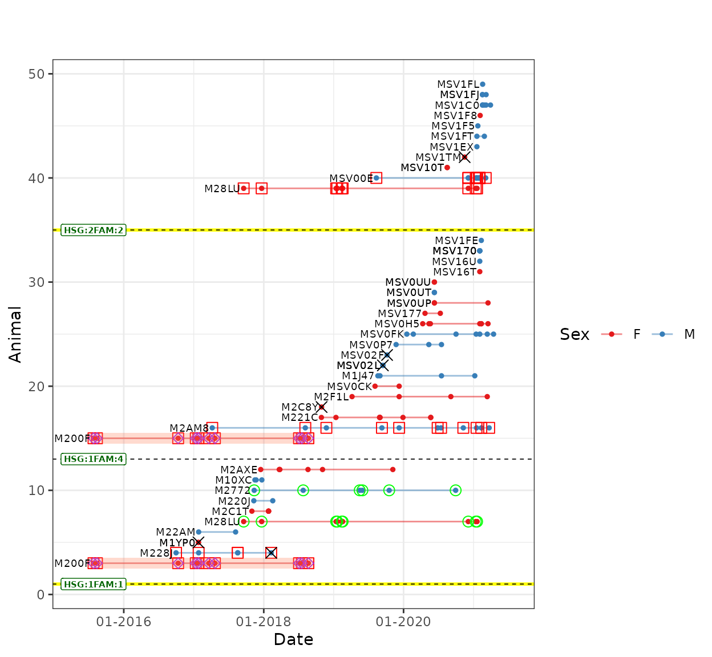
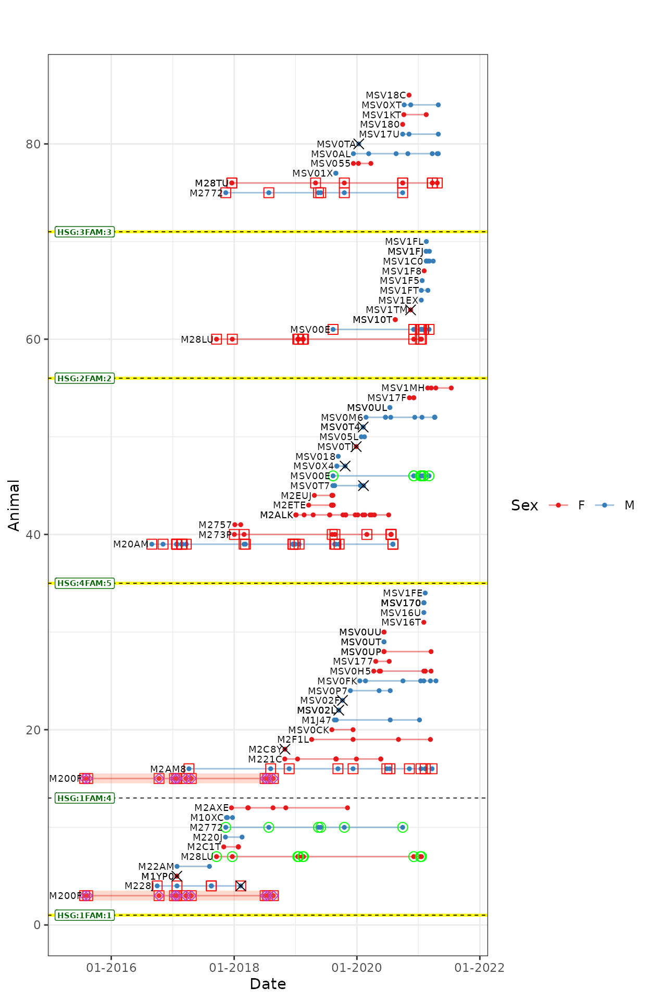

# Introduction to wpeR package

Welcome to the **wpeR** vignette! **wpeR** is an R package designed for
analyzing wild pedigree data. Pedigree reconstruction is a powerful tool
for understanding the genetic structure of wild populations, but it can
also generate large and complex datasets that can be difficult to
analyze. **wpeR** provides a streamlined solution for exploring and
visualizing this type of data, allowing the user to gain insights into
the genetic relationships between individuals in wild populations. In
this vignette, we will introduce the main features of **wpeR** and
demonstrate how they can be used to analyze and interpret wild
pedigrees.

To get started, you can install the stable release of the package from
CRAN:

``` r

install.packages("wpeR")
```

Alternatively, you can install the package from GitHub:

``` r

devtools::install_github("GR3602/wpeR")
```

You should be now able to load **wpeR**.

``` r

library(wpeR)
```

## Input data

**wpeR** works with two main input datasets:

1.  **Pedigree**

    1.  [COLONY](https://www.zsl.org/about-zsl/resources/software/colony)
        pedigree data.The reconstructed pedigree is an output of COLONY
        software and is stored in the colony project output folder. The
        function
        [`get_colony()`](https://gr3602.github.io/wpeR/reference/get_colony.md)
        automatically reads the pedigree file so you do not need to
        import it into the R session.

    2.  Custom pedigree data. Users can work with pedigree data
        reconstructed by any software as long as it follows the
        formatting rules specified in the
        [`get_ped()`](https://gr3602.github.io/wpeR/reference/get_ped.md)
        function.

2.  **Genetic samples metadata**.  
    This dataset should include information on all genetic samples
    belonging to the animals included in the pedigree and must include
    columns that describe:

    - Sample unique identifier code.
    - Date of sample collection in `YYYY-MM-DD` format.
    - Identifier code of the particular individual that the sample
      belongs to.
    - Genetic sex coded as `M` for males, `F` for females and `NA` for
      unknown sex.
    - Geographic location from where the sample was collected, as
      latitude and longitude in WGS84 coordinate system (EPSG: 4326).
    - Sample type eg: scat, urine, tissue.
    - Logical (˙TRUE˙/`FALSE`) column marking samples collected from
      dead animals (eg: tissue from a carcass).  

Correctly formatted genetic samples metadata is crucial for the proper
functioning of **wpeR** functions. To ensure that your genetic samples
metadata conforms to the package’s rules, the package includes
[`check_sampledata()`](https://gr3602.github.io/wpeR/reference/check_sampledata.md)
function. This function performs a series of checks and validations on
your input data to verify its integrity and compatibility. If all the
validations are passed the
[`check_sampledata()`](https://gr3602.github.io/wpeR/reference/check_sampledata.md)
function outputs the sample metadata data frame that can be seamlessly
used in downstream analyses.

An example pedigree and sample metadata (`wolf_samples`) is included in
this package and this two datasets will be used throughout this
vignette.

To check if the genetic sample metadata is formatted correctly you can
link the columns in the data frame with the parameters of the
[`check_sampledata()`](https://gr3602.github.io/wpeR/reference/check_sampledata.md)
function:

``` r

sampledata <- check_sampledata(
  Sample = wolf_samples$Sample,
  Date = wolf_samples$Date,
  AnimalRef = wolf_samples$AnimalRef,
  GeneticSex = wolf_samples$GeneticSex,
  lat = wolf_samples$lat,
  lng = wolf_samples$lng,
  SType = wolf_samples$SType,
  IsMortality = wolf_samples$IsMortality
)
```

If there are no errors or warnings during the execution of the
[`check_sampledata()`](https://gr3602.github.io/wpeR/reference/check_sampledata.md)
function, it indicates that the genetic sample metadata is correctly
formatted. You can use the returned data frame, in downstream analyses.
Example of properly formatted sample metadata with all required columns
looks like this:

``` r

head(sampledata)
#>   Sample       Date AnimalRef GeneticSex      lat      lng SType IsMortality
#> 1  M10XC 2017-11-16     M10XC          M 45.70766 14.12922  Scat       FALSE
#> 2  M0PXH 2017-11-22     M10XC          M 45.71356 14.10497  Scat       FALSE
#> 3  M0PFL 2017-12-22     M10XC          M 45.69898 14.07907  Scat       FALSE
#> 4  M1J47 2019-08-20     M1J47          M 45.70854 14.09644  Scat       FALSE
#> 5  M1HF2 2019-08-31     M1J47          M 45.69930 14.05550  Scat       FALSE
#> 6 MSV163 2020-07-17     M1J47          M 45.71804 14.14319  Scat       FALSE
```

## The workflow

Since many of the functions in **wpeR** build upon the results of
previous functions, it is recommended to follow a specific sequence when
using the package. Here, we present the optimal workflow for using
**wpeR**.

[TABLE]

### Import the pedigree

**COLONY PEDIGREE DATA**

Pedigree reconstructed by COLONY software is imported into the R session
by
[`get_colony()`](https://gr3602.github.io/wpeR/reference/get_colony.md)
function. Apart form reading the colony output file
[`get_colony()`](https://gr3602.github.io/wpeR/reference/get_colony.md)
also adds missing parents to OffspirngID, assigns sex to each animal and
adds the probability of paternity and maternity assignment as calculated
by COLONY.

``` r

path <- paste0(system.file("extdata", package = "wpeR"), "/wpeR_samplePed")
ped_colony <- get_colony(
  colony_project_path = path, 
  sampledata =  wolf_samples
  )

tail(ped_colony)
#>    ClusterIndex     id father mother sex
#> 60            1 MSV0T7  M20AM  M273P   1
#> 61            1 MSV0TJ  M20AM  M273P   2
#> 62            1 MSV0UL  M20AM  M273P   1
#> 63            1 MSV0X4  M20AM  M273P   1
#> 64            1 MSV17F  M20AM  M273P   2
#> 65            1 MSV1MH  M20AM  M273P   2
```

**CUSTOM PEDIGREE DATA**

In cases when the pedigree was not reconstructed with COLONY software
you must use the
[`get_ped()`](https://gr3602.github.io/wpeR/reference/get_ped.md)
function. Under the hood the
[`get_colony()`](https://gr3602.github.io/wpeR/reference/get_colony.md)
and [`get_ped()`](https://gr3602.github.io/wpeR/reference/get_ped.md)
are very similar, the latter having a little less functionalities,
because it is primarily designed so that any pedigree data can be used
in downstream analysis. When using
[`get_ped()`](https://gr3602.github.io/wpeR/reference/get_ped.md)
function it is important to note that the `ped` parameter (the
reconstructed pedigree) has to be formatted as a basic pedigree with
three columns corresponding to offspring (has to be named OffspringID),
father (has to be named FatherID) and mother (has to be named MotherID).
Unknown parents should be represented by `NA` values.

``` r

ped <- data.frame(
  OffspringID = c(
    "M273P", "M20AM", "M2757", "M2ALK", "M2ETE", "M2EUJ", "MSV00E",
    "MSV018", "MSV05L", "MSV0M6", "MSV0T4", "MSV0T7", "MSV0TJ", "MSV0UL"
  ),
  FatherID = c(
    NA, NA, "M20AM", "M20AM", "M20AM", "M20AM", "M20AM",
    "M20AM", "M20AM", "M20AM", "M20AM", "M20AM", "M20AM", "M20AM"
  ),
  MotherID = c(
    NA, NA, "M273P", "M273P", "M273P", "M273P", "M273P",
    "M273P", "M273P", "M273P", "M273P", "M273P", "M273P", "M273P"
  )
)


get_ped(
    ped = ped,
    sampledata = wolf_samples
    )
#>        id father mother sex
#> 1   M273P   <NA>   <NA>   2
#> 2   M20AM   <NA>   <NA>   1
#> 3   M2757  M20AM  M273P   2
#> 4   M2ALK  M20AM  M273P   2
#> 5   M2ETE  M20AM  M273P   2
#> 6   M2EUJ  M20AM  M273P   2
#> 7  MSV00E  M20AM  M273P   1
#> 8  MSV018  M20AM  M273P   1
#> 9  MSV05L  M20AM  M273P   1
#> 10 MSV0M6  M20AM  M273P   1
#> 11 MSV0T4  M20AM  M273P   1
#> 12 MSV0T7  M20AM  M273P   1
#> 13 MSV0TJ  M20AM  M273P   2
#> 14 MSV0UL  M20AM  M273P   1
```

The output of the
[`get_colony()`](https://gr3602.github.io/wpeR/reference/get_colony.md)
and [`get_ped()`](https://gr3602.github.io/wpeR/reference/get_ped.md)
functions can can be formatted in different ways to facilitate
downstream analysis with other R packages for pedigree analysis and
visualization. The format of the output is defined by `out` parameter.
Both functions support downstream analysis with
[`kinship2`](https://cran.r-project.org/package=kinship2),
[`pedtools`](https://cran.r-project.org/package=pedtools) or
[`FamAgg`](https://bioconductor.org/packages/FamAgg/) packages.

#### \[example\] get_colony() & kinship2

``` r

library(kinship2)
#> Loading required package: Matrix
#> Loading required package: quadprog
#> Warning: kinship2 package is deprecated for R <= 4.5; switch functionality to
#> Pedixplorer from BioConductor
ped_ks2 <- get_colony(path, wolf_samples, out = "kinship2")

ped_ks2 <- ped_ks2[!(ped_ks2$dadid %in% "M2AM8"),]

ped_ks2 <- pedigree(
  ped_ks2$id,
  ped_ks2$dadid,
  ped_ks2$momid,
  ped_ks2$sex
)
```

``` r

plot(ped_ks2, symbolsize = 1.5, cex = 0.4)
```


    #> Did not plot the following people: M2AM8

### Animal timespan

[`anim_timespan()`](https://gr3602.github.io/wpeR/reference/anim_timespan.md)
function creates ‘first seen’ and ‘last seen’ columns for each animal in
the pedigree by examining the dates of all genetic samples associated
with that animal. This is an important step in obtaining a temporal
perspective of the pedigree, as it allows other functions to work with
time frame over which each animal was observed. Besides that, the
function determines if an animal is dead based on the `mortality_sample`
argument. This argument takes a logical vector that marks samples
collected from dead animals (e.g. tissue from a carcass). If at least
one of the animal’s samples is flagged as a mortality sample, the animal
is marked as dead.

``` r

animal_ts <- anim_timespan(
  individual_id = wolf_samples$AnimalRef,
  sample_date = wolf_samples$Date,
  mortality_sample = wolf_samples$IsMortality
)

head(animal_ts)
#>      ID  FirstSeen   LastSeen IsDead
#> 1 M10XC 2017-11-16 2017-12-22  FALSE
#> 2 M1J47 2019-08-20 2021-01-07  FALSE
#> 3 M1YP0 2017-01-25 2017-01-25   TRUE
#> 4 M200F 2015-07-27 2018-08-22  FALSE
#> 5 M20AM 2016-08-29 2020-08-02  FALSE
#> 6 M220J 2017-11-10 2018-02-17  FALSE
```

As shown above the
[`anim_timespan()`](https://gr3602.github.io/wpeR/reference/anim_timespan.md)
function creates a sort of a code list of animal detection time frame.
To feed this data to subsequent functions the
[`anim_timespan()`](https://gr3602.github.io/wpeR/reference/anim_timespan.md)
function output needs to be merged with sample metadata. This additional
step ensures that all relevant information about each animal is included
and facilitates downstream analysis.

``` r

sampledata <- merge(wolf_samples, animal_ts, by.x = "AnimalRef", by.y = "ID", all.x = TRUE )
head(sampledata)
#>   AnimalRef Sample       Date GeneticSex      lat      lng SType IsMortality
#> 1     M10XC  M10XC 2017-11-16          M 45.70766 14.12922  Scat       FALSE
#> 2     M10XC  M0PXH 2017-11-22          M 45.71356 14.10497  Scat       FALSE
#> 3     M10XC  M0PFL 2017-12-22          M 45.69898 14.07907  Scat       FALSE
#> 4     M1J47  M1J47 2019-08-20          M 45.70854 14.09644  Scat       FALSE
#> 5     M1J47  M1HF2 2019-08-31          M 45.69930 14.05550  Scat       FALSE
#> 6     M1J47 MSV163 2020-07-17          M 45.71804 14.14319  Scat       FALSE
#>    FirstSeen   LastSeen IsDead
#> 1 2017-11-16 2017-12-22  FALSE
#> 2 2017-11-16 2017-12-22  FALSE
#> 3 2017-11-16 2017-12-22  FALSE
#> 4 2019-08-20 2021-01-07  FALSE
#> 5 2019-08-20 2021-01-07  FALSE
#> 6 2019-08-20 2021-01-07  FALSE
```

### Organize families

The [`org_fams()`](https://gr3602.github.io/wpeR/reference/org_fams.md)
function takes the pedigree data generated by the
[`get_colony()`](https://gr3602.github.io/wpeR/reference/get_colony.md)/[`get_ped()`](https://gr3602.github.io/wpeR/reference/get_ped.md)
function and groups animals into families. This function expands the
pedigree by adding information about the family that each individual was
born in and the individual’s status as a reproductive animal. Based on
the ´output´ parameter the function can return a data frame (ped or
fams) or a list with two objects (ped and fams). In the examples below
we will present each of the two data frames separately.

The result of
[`org_fams()`](https://gr3602.github.io/wpeR/reference/org_fams.md)
function introduces us to two important concepts within the context of
this package: *family* and *half-sib group*. In the **wpeR** package, a
*family* is defined as a group of animals where at least one parent and
at least one offspring are known. Meanwhile, a *half-sib group* refers
to a group of half-siblings who are either maternally or paternally
related. In the function’s output, the `DadHSgroup` parameter groups
paternal half-siblings, while the `MomHSgroup` parameter groups maternal
half-siblings.

#### Pedigree

``` r

ped_org <- org_fams(ped = ped_colony, sampledata = sampledata, output = "ped")

tail(ped_org)
#>    ClusterIndex     id father mother sex     parents FamID  FirstSeen
#> 60            1 MSV0T7  M20AM  M273P   1 M20AM_M273P     5 2019-08-11
#> 61            1 MSV0TJ  M20AM  M273P   2 M20AM_M273P     5 2019-12-28
#> 62            1 MSV0UL  M20AM  M273P   1 M20AM_M273P     5 2020-07-15
#> 63            1 MSV0X4  M20AM  M273P   1 M20AM_M273P     5 2019-09-03
#> 64            1 MSV17F  M20AM  M273P   2 M20AM_M273P     5 2020-11-08
#> 65            1 MSV1MH  M20AM  M273P   2 M20AM_M273P     5 2021-02-25
#>      LastSeen IsDead DadHSgroup MomHSgroup hsGroup
#> 60 2020-02-09   TRUE       <NA>       <NA>       4
#> 61 2019-12-28   TRUE       <NA>       <NA>       4
#> 62 2020-07-15  FALSE       <NA>       <NA>       4
#> 63 2019-10-23   TRUE       <NA>       <NA>       4
#> 64 2020-12-04  FALSE       <NA>       <NA>       4
#> 65 2021-07-15  FALSE       <NA>       <NA>       4
```

The `ped` output is just an extend version of pedigree obtained by
[`get_colony()`](https://gr3602.github.io/wpeR/reference/get_colony.md)
function. Apart from common pedigree information individual, mother,
father, sex, family), `ped` also includes information on:

- `parents`: identifier codes of both parents separated with ⁠\_⁠,
- `FamID`: number of family that the individual belongs to (see Families
  below),
- `FirstSeen`: date of first sample of individual,
- `LastSeen`: date of last sample of individual,
- `IsDead`: logical value (TRUE/FALSE) that identifies if the individual
  is dead,
- `DadHSgroup`: identifier of paternal half-sib group,
- `MomHSgroup`: identifier of maternal half-sib group,
- `hsGroup`: half-sib group of the individual.

#### Families

``` r

fams_org <- org_fams(ped = ped_colony, sampledata = sampledata, output = "fams")

head(fams_org)
#>         parents   father   mother FamID   FamStart     FamEnd FamDead
#> 7   M228J_M200F    M228J    M200F     1 2017-01-25 2018-08-22    TRUE
#> 15 MSV00E_M28LU   MSV00E    M28LU     2 2020-08-16 2021-03-05   FALSE
#> 24  M2772_M28TU    M2772    M28TU     3 2019-08-28 2021-04-23   FALSE
#> 33  M2AM8_M200F    M2AM8    M200F     4 2018-10-29 2021-03-23   FALSE
#> 51  M20AM_M273P    M20AM    M273P     5 2018-01-05 2020-08-02   FALSE
#> NA      Unknown *Unknown #Unknown     0 2015-07-27 2021-04-23   FALSE
#>    DadHSgroup MomHSgroup hsGroup
#> 7        <NA>     MomP_1       1
#> 15       <NA>       <NA>       2
#> 24       <NA>       <NA>       3
#> 33       <NA>     MomP_1       1
#> 51       <NA>       <NA>       4
#> NA       <NA>       <NA>       0
```

The `fams` output contains information about the families to which
individuals in the pedigree belong. The families are described by:

- `parents`: identifier codes of both parents separated with ⁠\_⁠,
- `father`: identifier code of the father,
- `mother`: identifier code of the mother,
- `FamID`: numeric value that identifies a particular family,
- `famStart`: date when the first sample of any of the offspring was
  collected¹,
- `famEnd`: date when the last sample from either the mother or the
  father was collected¹,
- `FamDead`: logical value (TRUE/FALSE) that identifies if the family
  does not exist any more,
- `DadHSgroup`: Identifier connecting families that share the same
  father.
- `MomHSgroup`: Identifier connecting families that share the same
  mother.
- `hsGroup`: Numeric value connecting families that share one of the
  parents.

¹`famStart` and `famEnd` columns, estimate a time window for the family
based solely on sample collection dates provided in `sampledata`.
`famStart` indicates the date of the earliest sample collected from any
offspring belonging to that family. `famEnd` indicates the date of the
last sample collected from either the mother or the father of that
family. It is important to recognize that this method relies on
observation (sampling) dates. Consequently, `famEnd` (last parental
sample date) can precede `famStart` (first offspring sample date),
creating a biologically impossible sequence and a negative calculated
family timespan. Users should interpret the interval between `famStart`
and `famEnd` with this understanding.

### Plotting table

To produce a temporal and spatial pedigree representation, the sample
metadata needs to be formatted in a specific way, which can be achieved
with the
[`plot_table()`](https://gr3602.github.io/wpeR/reference/plot_table.md)
function. This function combines the outputs of previous functions
(`fams` and `ped` from the
[`org_fams()`](https://gr3602.github.io/wpeR/reference/org_fams.md)
function) with sample metadata, with all three data frames serving as
inputs.

The function offers filtering options to isolate specific parts of your
pedigree for visualization via two arguments:

- **`plot_fams`**: Accepts a numeric vector of specific `FamID` numbers
  (generated by
  [`org_fams()`](https://gr3602.github.io/wpeR/reference/org_fams.md))
  to plot only those families.
- **`plot_indivs`**: Accepts a character vector of individual
  identifiers. The function automatically identifies and includes any
  families where these individuals appear as a parent (father/mother) or
  offspring.

> **Default Behavior:** If both `plot_fams` and `plot_indivs` are left
> as `NULL` (the default), all families in the pedigree are included. If
> you provide values for both arguments, the function will return the
> **union** of the families identified by both filters.

In order for the
[`plot_table()`](https://gr3602.github.io/wpeR/reference/plot_table.md)
function to work sample metadata has to include some specific
information, most of them are already defined in the Input data part of
this vignette, apart form them the sample metadata must also include
columns on the date of first and last sample of individual and logical
value identifying if the individual is dead. All this additional
information can be added by
[`anim_timespan()`](https://gr3602.github.io/wpeR/reference/anim_timespan.md)
function (see *Animal timespan* section). If your sample data uses
non-standard column headers, you can map your custom names by passing a
character vector to the `datacolumns` parameter. You can review the
default expected column names by checking the function documentation
([`?plot_table`](https://gr3602.github.io/wpeR/reference/plot_table.md)).

``` r

pt <- plot_table(
  plot_fams = NULL,
  plot_indivs = NULL,
  all_fams = fams_org,
  ped = ped_org,
  sampledata = sampledata
)

head(pt)
#>     Sample AnimalRef GeneticSex       Date  SType      lat      lng  FirstSeen
#> 54   M20AP     M228J          M 2016-09-30 Saliva 45.71140 14.01201 2016-09-30
#> 55   M228J     M228J          M 2017-01-26   Scat 45.70406 14.12798 2016-09-30
#> 56   M28ML     M228J          M 2017-08-18 Saliva 45.67397 14.11150 2016-09-30
#> 57   M28MM     M228J          M 2017-08-18 Saliva 45.67397 14.11150 2016-09-30
#> 58   M2C36     M228J          M 2018-02-09 Tissue 45.67033 14.15404 2016-09-30
#> 10 EX.1JH0     M200F          F 2015-07-27 Saliva 45.75250 14.14653 2015-07-27
#>      LastSeen IsDead IsMortality plottingID FamID hsGroup  rep later_rep
#> 54 2018-02-09   TRUE       FALSE          1     1       1 TRUE     FALSE
#> 55 2018-02-09   TRUE       FALSE          1     1       1 TRUE     FALSE
#> 56 2018-02-09   TRUE       FALSE          1     1       1 TRUE     FALSE
#> 57 2018-02-09   TRUE       FALSE          1     1       1 TRUE     FALSE
#> 58 2018-02-09   TRUE        TRUE          1     1       1 TRUE     FALSE
#> 10 2018-08-22  FALSE       FALSE          2     1       1 TRUE     FALSE
#>    isPolygamous  dead first_sample last_sample
#> 54        FALSE FALSE         TRUE       FALSE
#> 55        FALSE FALSE        FALSE       FALSE
#> 56        FALSE FALSE        FALSE       FALSE
#> 57        FALSE FALSE        FALSE       FALSE
#> 58        FALSE  TRUE        FALSE        TRUE
#> 10         TRUE FALSE         TRUE       FALSE
```

The
[`plot_table()`](https://gr3602.github.io/wpeR/reference/plot_table.md)
function output adds additional information to sample metadata which
include:

- `plottingID`: Identifier number for temporal pedigree plot
  `ped_satplot`. In case of polygamous animals same individual can be
  included in more than one family,
- `FamID`: Identifier number of family that individual belongs to,
- `hsGroup`: Numeric. Identifier number for the half-sib group of
  individual.
- `rep`: Is individual reproductive in current family, (current family
  defined with FamID for a particular entry),
- `later_rep`: Is individual reproductive in any other (later) families,
- `isPolygamous`: Has individual more than one mate,
- `dead`: Is individual dead,
- `first_sample`: Is this particular sample the first sample of
  individual,
- `last_sample`: Is this particular sample the last sample of
  individual,

Apart from adding additional information to sample metadata,
[`plot_table()`](https://gr3602.github.io/wpeR/reference/plot_table.md)
also duplicates sample entries (rows) for animals that are present in
more than one family (eg. polygamous animals, animals that were detected
as offspring in one family and later as reproductive animal in another).
Considering that, it is crucial for users to be aware of this data
duplication when utilizing the
[`plot_table()`](https://gr3602.github.io/wpeR/reference/plot_table.md)
output in analysis outside of the scope of this package.

``` r

nrow(sampledata) == nrow(pt)
#> [1] FALSE
```

After applying the
[`plot_table()`](https://gr3602.github.io/wpeR/reference/plot_table.md)
function, the pedigree data is prepared for temporal and spatial
visualization, marking the completion of the data preparation phase in
this package’s workflow. The data visualization stage involves two
functions:
[`ped_satplot()`](https://gr3602.github.io/wpeR/reference/ped_satplot.md)
for temporal representation and
[`ped_spatial()`](https://gr3602.github.io/wpeR/reference/ped_spatial.md)
for spatial representation.

### Temporal plot

The core of the temporal plot, generated by the
[`ped_satplot()`](https://gr3602.github.io/wpeR/reference/ped_satplot.md)
function, is the representation of the occurrence of samples for each
individual (y-axis) trough time (x-axis). Furthermore the individuals
are first grouped by families and then by half-sib groups. Within each
family, the individuals are arranged from top to bottom based on the
date of their first sample collection. At the bottom of each family, the
animal that was initially detected is positioned, followed by subsequent
animals in chronological order. This layout enables a visual
understanding of the temporal relationships within and between families,
with each family forming a distinct cluster in the plot.

Each sample is visually depicted as a point on the plot, and these
points are connected by lines to represent the continuous survival of
the individual. This connection remains intact even during periods where
no samples of that particular individual were collected. Each sample can
be additional marked to represent any additional characteristics of a
particular individual (eg. reproductive animal, polygamous animal).
Additionally, samples that have `IsMortality` flag are marked to
indicate mortality.


Before we get started with the first plot it is important to look back
at
[`plot_table()`](https://gr3602.github.io/wpeR/reference/plot_table.md)
function and the previously mentioned *plot_fams* and *plot_indivs*
parameter. This parameter allow us to select a subset of families that
we would like to plot. In the below example just one family (FamID = 4)
is selected for plotting.

``` r

pt <- plot_table(
  plot_fams = 4,
  plot_indivs = NULL,
  all_fams = fams_org,
  ped = ped_org,
  sampledata = sampledata
)

sp <- ped_satplot(pt)

sp 
```



An example of all families connected to M28LU indiviudal. you can also
specify multiple individuals within a vector ˙plot_indivs = c(ind1,
ind2, …)˙

``` r

pt <- plot_table(
  plot_fams = NULL,
  plot_indivs = "M28LU",
  all_fams = fams_org,
  ped = ped_org,
  sampledata  = sampledata
)

sp <- ped_satplot(pt)

sp 
```



An example of two families that share the same mother (FamID = 1 & 4)

``` r

pt <- plot_table(
  plot_fams = c(1,4),
  all_fams = fams_org,
  ped = ped_org,
  sampledata = sampledata
)

sp <- ped_satplot(pt)

sp
```



The same plot can be also achieved by specifiing the individual of
interest polygamous mother *M200F* in the `plot_indivs` parameter

``` r
pt <- plot_table(
  plot_indivs = "M200F"
  all_fams = fams_org,
  ped = ped_org,
  sampledata = sampledata
)
```

An example of combining the `plot_fams` and `plot_indivs`, you get a
union of all the families listed in `plot_fams` and all the families
that the individual from `plot_indivs` is a part of.

``` r

pt <- plot_table(
  plot_fams = c(1,4),
  plot_indivs = "M28LU",
  all_fams = fams_org,
  ped = ped_org,
  sampledata  = sampledata
)

sp <- ped_satplot(pt)

sp 
```



Technically, there is no limit to the number of families that can be
plotted in this manner. However, as the number of families increases,
the complexity of the graph intensifies, making it progressively more
challenging to comprehend. This can be observed in the example of five
families, two of which share a reproductive animal.

``` r

pt <- plot_table(
  plot_fams = c(1:5),
  all_fams = fams_org,
  ped = ped_org,
  sampledata = sampledata,
  )

sp <- ped_satplot(pt)

sp
```



### Spatial files

To incorporate a spatial dimension into the pedigree analysis, the
[`ped_spatial()`](https://gr3602.github.io/wpeR/reference/ped_spatial.md)
function comes into play. Acting as a wrapper function,
[`ped_spatial()`](https://gr3602.github.io/wpeR/reference/ped_spatial.md)
combines multiple functions that utilize the output of the
[`plot_table()`](https://gr3602.github.io/wpeR/reference/plot_table.md)
function, transforming it into various
[sf](https://r-spatial.github.io/sf/articles/sf1.html) objects that can
be visualized on a map. It’s worth noting that the function
automatically removes samples without coordinates, as they cannot be
plotted.

By utilizing the default function parameters, the ped_spatial() function
produces a list containing 14 `sf` objects.

``` r

pt <- plot_table(
  plot_fams = 1,
  all_fams = fams_org,
  ped = ped_org,
  sampledata = sampledata,
  
)

ps <- ped_spatial(pt)

summary(ps)
#>                       Length Class Mode
#> motherRpoints         16     sf    list
#> fatherRpoints         16     sf    list
#> offspringRpoints      19     sf    list
#> motherMovePoints      16     sf    list
#> fatherMovePoints      16     sf    list
#> offspringMovePoints   19     sf    list
#> maternityLines         8     sf    list
#> paternityLines         8     sf    list
#> motherMoveLines        3     sf    list
#> fatherMoveLines        3     sf    list
#> offspringMoveLines     3     sf    list
#> motherMovePolygons     3     sf    list
#> fatherMovePolygons     3     sf    list
#> offspringMovePolygons  3     sf    list
```

Through the integration of `POINT`, `LINESTRING`, and `POLYGON`
geometries, the
[`ped_spatial()`](https://gr3602.github.io/wpeR/reference/ped_spatial.md)
function generates `sf` objects that establish connections between
parent and offspring samples, as well as samples of the same individual.
This enables users to analyze and interpret the spatial progression of a
pedigree. Created objects can be categorized into 5 broader categories:

- `...Rpoints`: POINT object representing reference sample of each
  animal. In the case of `...Rpoints` the number of points represents
  the number of animals included in
  [`plot_table()`](https://gr3602.github.io/wpeR/reference/plot_table.md)
  function output. The reference points represent just one sample of
  each individual. For reproductive individuals (mothers and fathers), a
  reference point is the location of their last sample within the
  specified time window. For offspring, the reference point is the
  location of their first sample within the time window.
- `...MovePoints`: POINT object representing all samples of a particular
  animal.
- `maternity/paternityLines`: LINESTRING object connecting reference
  samples of mothers (`motherRpoints`) or fathers (`fatherRpoints`) with
  reference samples of their offspring (`offspringRpoints`). These lines
  visually depict the parent-offspring relationships in the pedigree.
- `...MoveLines`: LINESTRING object connecting `...MovePoints` of an
  individual in chronological order, showcasing the movement or changes
  in location over time for the specific animal.
- `...MovePolygons`: POLYGON object representing a convex hull that
  encloses all the samples of an individual. It provides a graphical
  representation of the spatial extent or range covered by the animal
  based on its sample locations.

By specifying the *fulsibdata* parameter in the
[`ped_spatial()`](https://gr3602.github.io/wpeR/reference/ped_spatial.md)
function, you can include the `FullsibLines` object in the output list.
The `FullsibLines` is a LINESTRING object connecting reference samples
of full siblings.

``` r

fullsibdata <- read.csv(paste0(path,".FullSibDyad"))

ps <- ped_spatial(pt, fullsibdata = fullsibdata)

summary(ps)
#>                       Length Class Mode
#> motherRpoints         16     sf    list
#> fatherRpoints         16     sf    list
#> offspringRpoints      19     sf    list
#> motherMovePoints      16     sf    list
#> fatherMovePoints      16     sf    list
#> offspringMovePoints   19     sf    list
#> maternityLines         8     sf    list
#> paternityLines         8     sf    list
#> motherMoveLines        3     sf    list
#> fatherMoveLines        3     sf    list
#> offspringMoveLines     3     sf    list
#> motherMovePolygons     3     sf    list
#> fatherMovePolygons     3     sf    list
#> offspringMovePolygons  3     sf    list
#> FullsibLines           4     sf    list
```

In the
[`ped_spatial()`](https://gr3602.github.io/wpeR/reference/ped_spatial.md)
function, you have the flexibility to define the time window for
selecting the samples used to generate the spatial pedigree outputs. By
specifying the *time.limits* parameter, you can set the start and end
dates that limit the samples included in the spatial representation. The
*time.limits* parameter is defined as a vector of two dates in `Date`
format. Moreover, the function provides the option to apply
*time.limits* selectively to specific types of output data: -
`time.limit.rep`parameter enables the application of time limits solely
to offspring reference and movement points, - `time.limit.offspring`
parameter applies the time.limits to offspring reference and movement
points, - `time.limit.moves` parameter permits the application of time
limits to the movement lines of all individuals.

``` r

ps_tl <- ped_spatial(
  plottable = pt,
  time.limits = c(as.Date("2017-01-01"), as.Date("2018-01-01")),
  time.limit.rep = TRUE,
  time.limit.offspring = TRUE,
  time.limit.moves = TRUE
)
```

#### \[example\] Drawing maps in R

To showcase the capabilities of the
[`ped_spatial()`](https://gr3602.github.io/wpeR/reference/ped_spatial.md)
function and to deepen our comprehension of the data frames generated by
this function, we present a series of examples that highlight maps
produced through the utilization of the wpeR package. These examples
make use of various R packages enable visual representation of
geographic datasets.

##### ggplot2

In the similar fashion as the temporal plots in chapter 2.5, the first
set of maps shows just one family. The maps are static and produced with
[`ggplot2`](https://CRAN.R-project.org/package=ggplot2),
[`basemaps`](https://CRAN.R-project.org/package=basemaps) and
[`ggsflabel`](https://github.com/yutannihilation/ggsflabel) packages. To
clearly represent the output of
[`ped_spatial()`](https://gr3602.github.io/wpeR/reference/ped_spatial.md)
function different spatial files are presented separately on three maps.
First showing the pedigree, second movement of reproductive animals and
the third movement of the offspring. Furthermore, each of the three maps
is represented in two different variants, one showing all the samples of
the family members included in the sample metadata table and the other
utilizing the *time.limits* parameter, subletting the samples to within
a defined time window (presented on temporal plot with orange dotted
rectangle).

We begin by creating a plotting table (plot.table) of the
family/families we would like to plot (in this example family with FamID
== 1), through the
[`plot_table()`](https://gr3602.github.io/wpeR/reference/plot_table.md)
function. Subsequently, the
[`ped_spatial()`](https://gr3602.github.io/wpeR/reference/ped_spatial.md)
function is applied to generate a list of `sf` data frames representing
the distribution of animal samples and their relationships. Additionally
we generate a second list of `sf` files in which all the generated
dataframes are limited to the period between “2017-01-01” and
“2018-01-01”.

It is worth noting that depending on the number of families, individuals
and samples the maps generated from these data can appear complex and
cluttered, especially if the time.limits parameter is not employed. This
parameter is crucial in refining the visualizations, enhancing their
clarity and interpretability.

``` r

pt <- plot_table(
  plot_fams = 1,
  all_fams = fams_org,
  ped = ped_org,
  sampledata = sampledata
)

ps <- ped_spatial(pt)

ps.tl <- ped_spatial(
  plottable = pt,
  time.limits = c(as.Date("2017-01-01"), as.Date("2018-01-01")),
  time.limit.rep = TRUE,
  time.limit.offspring = TRUE,
  time.limit.moves = TRUE
)
```


Temporal plot, showing all individuals and samples of the plotted
family. Orange dashed rectangle encopasses samples that fall within
defined time limits.

  


Legend explaining symbols used for spatial pedigree representation.

  


Spatial pedigree representation. a) all samples, b) time window.

  


Movement of reproductive animals as inffered from collected samples. a)
all samples, b) time window.

  


Movement of offspring as inffered from collected samples. a) all
samples, b) time window.

  

##### leaflet

``` r

library(leaflet)
library(leaflet.providers)

pt <- plot_table(plot_fams = c(1:5),
                all_fams = fams_org,
                ped = ped_org,
                sampledata = sampledata
                        )

ps <- ped_spatial(pt,
                  time.limits = c(as.Date("2020-07-01"), as.Date("2021-06-30")),
            time.limit.rep = TRUE,
            time.limit.offspring = TRUE,
            time.limit.moves = TRUE)
```

#### GIS output

As described above the default output of the `ped_spatila()` function is
a list of `sf` objects that can be further analyzed and visualized using
R packages that enable visual representation of geographic datasets such
as [leaflet](https://rstudio.github.io/leaflet/) and
[mapview](https://r-spatial.github.io/mapview/).

To extend the possibilities of spatial analysis and visualization
outside of R,
[`ped_spatial()`](https://gr3602.github.io/wpeR/reference/ped_spatial.md)provides
the flexibility for users to export the spatial data in formats
compatible with Geographic Information System (GIS) software. By
specifying the `"gis"` value for the *output* parameter and defining a
folder path in the *path* parameter, users can store the georeferenced
files in the designated folder. This allows for seamless integration and
utilization of the pedigree data with GIS software, unlocking a wide
range of spatial analysis capabilities and visualization options.

``` r
pt <- plot_table(
  plot_fams = 1
  all_fams = fams_org,
  ped = ped_org,
  sampledata = sampledata
)

ps <- ped_spatial(
  plottable = pt,
  output = "gis",
  path = "/folder/where/GIS/files/shuld/be/saved/"
)
```

The created GIS files follow the same structure as described above, just
the output file names are different:

|       sf object       |  file name  |
|:---------------------:|:-----------:|
|     motherRpoints     |   momRef    |
|     fatherRpoints     |   dadRef    |
|   offspringRpoints    |  ofsprRef   |
|   motherMovePoints    |  momMovPt   |
|   fatherMovePoints    |  dadMovPt   |
|  offspringMovePoints  | offsprMovPt |
|    maternityLines     |    matLn    |
|    paternityLines     |    patLn    |
|    motherMoveLines    |  momMovLn   |
|    fatherMoveLines    |  dadMovLn   |
|  offspringMoveLines   | offsprMovLn |
|  motherMovePolygons   | momMovPoly  |
|  fatherMovePolygons   | dadMovPoly  |
| offspringMovePolygons | offsMovPoly |
|     FullsibLines      |   FsLines   |

To distinguish or avoid overwriting of generated files, the parameter
*filename* can be used. The string specified with this parameter acts as
a common name for all the files generated. When generating GIS files the
all the other function parameters can be used as described in the
beginning of this chapter (eg. *fullsibdata*, *time.limits*).  

## Outside of the workflow

Besides the functions that facilitate the visualization and analysis of
pedigree data in temporal and spatial dimensions, the **wpeR** package
currently provides an additional function designed to aid in the
calculation and representation of detected animals across multiple time
periods. This functions works just with sample metadata and can be used
independently of the workflow described in previous chapter.

To calculate the number of captured animals between two or more time
periods the function
[`nbtw_seasons()`](https://gr3602.github.io/wpeR/reference/nbtw_seasons.md)
is used. The function takes four parameters the first two: *animal_id*
and *capture_date* correspond to AnimalRef and Date column in the same
meta data table, respectively. The other two are vectors in ´Date´
format one corresponding to start and the other to end of the time
periods of interest. It is worth noting that the function refers to
these time periods as “seasons” in its terminology.

``` r

seasons <- data.frame(
  start = c(
    as.Date("2017-01-01"),
    as.Date("2018-01-01"),
    as.Date("2019-01-01")
  ),
  end = c(
    as.Date("2017-12-31"),
    as.Date("2018-12-31"),
    as.Date("2019-12-31")
  )
)

dyn_mat <- dyn_matrix(
  animal_id = wolf_samples$AnimalRef,
  capture_date = wolf_samples$Date,
  start_dates = seasons$start,
  end_dates = seasons$end
)


dyn_mat
#>                         2017-01-01 - 2017-12-31 2018-01-01 - 2018-12-31
#> 2017-01-01 - 2017-12-31                      13                       8
#> 2018-01-01 - 2018-12-31                       2                       4
#> 2019-01-01 - 2019-12-31                       0                       0
#> Tot. Skipped                                  0                       2
#>                         2019-01-01 - 2019-12-31 Tot. Capts
#> 2017-01-01 - 2017-12-31                       6         13
#> 2018-01-01 - 2018-12-31                       6         12
#> 2019-01-01 - 2019-12-31                      17         25
#> Tot. Skipped                                  0         NA
```

The function outputs a matrix with 1 + no. of time periods rows and
columns explaining the dynamics of animal deception between included
time periods. It conveys the information on all detected animals, newly
detected animals, recaptured animals and skipped animals. For the
purpose a more detailed explanation, we will drop the row and column
names.

``` r

unname(dyn_mat)
#>      [,1] [,2] [,3] [,4]
#> [1,]   13    8    6   13
#> [2,]    2    4    6   12
#> [3,]    0    0   17   25
#> [4,]    0    2    0   NA
```

In the matrix presented above:

- Column and row 4 correspond to the number of captured and number of
  skipped animals in the particular time period.
- The **diagonal** gives number of new detection in each time period.
- Numbers **above diagonal** correspond to the number of re-detected
  (recaptured) animals in time period x (column names) compared to time
  period y (row names).
- Numbers **below diagonal** correspond to the number of animals from
  time period y that were skipped in time period x.

**JUST TWO TIME PERIODS**  
To get the animal detection dynamics between just two time periods
[`nbtw_seasons()`](https://gr3602.github.io/wpeR/reference/nbtw_seasons.md)
function can be called. This function provides a simple output
representing a detection dynamics between two time periods. The function
takes six parameters. First two are the same as described above. The
other parameters correspond to strings in `Date` format defining the
start and end of time periods of interest.

``` r

nbtw_seasons(
 animal_id = wolf_samples$AnimalRef,
 capture_date = wolf_samples$Date,
 season1_start = as.Date("2017-01-01"),
 season1_end = as.Date("2017-12-31"),
 season2_start = as.Date("2018-01-01"),
 season2_end = as.Date("2018-12-31")
)
#>                   season1                 season2 total_cap new_captures
#> 1 2017-01-01 - 2017-12-31 2018-01-01 - 2018-12-31        12            4
#>   recaptures skipped
#> 1          8       2
```

The returned data frame first defines the two time periods and than
gives five values describing the detection of animals. `total_cap` gives
the number of detected animal in season 2, `new_captures` corresponds to
the number of new detection in season 2, `recaptured` to the number of
animals detected in season 1 and in season 2 and `skipped` just the
opposite, number of animals detected in season 1 but not in season 2.
