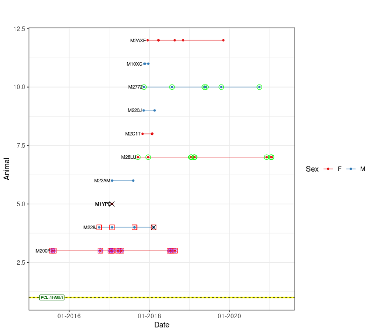
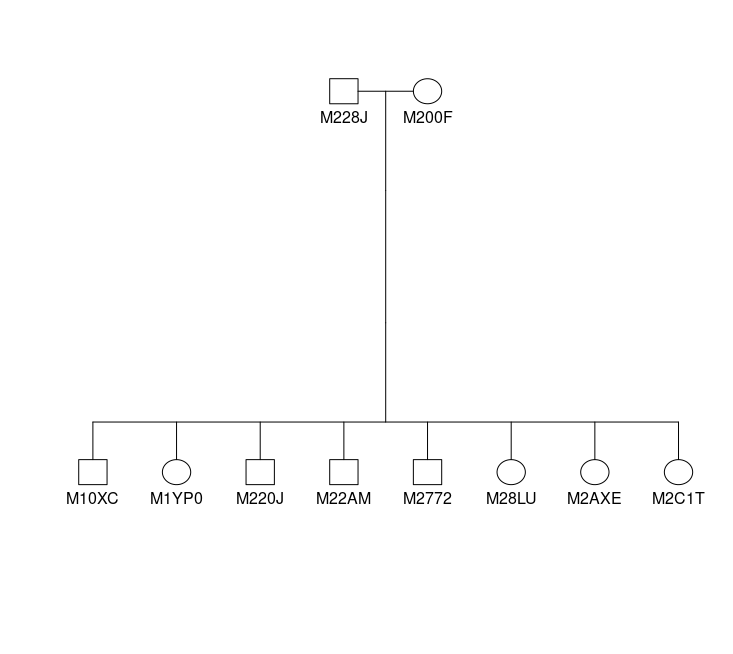
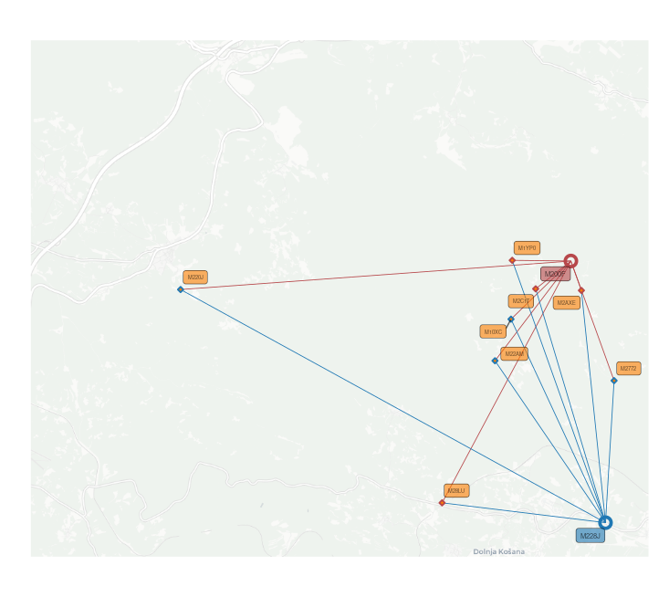
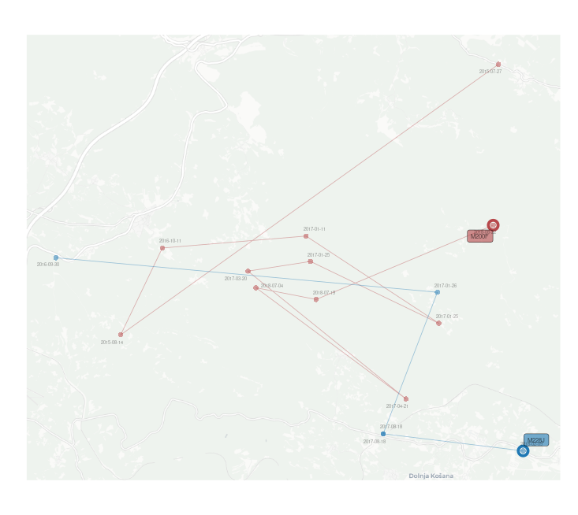

# wpeR

**w**ild **p**edigree **e**xplorer**R** is an R package designed to
simplify the analysis of wild pedigree data. The package was primarily
developed to work with pedigree data generated by
[COLONY](https://www.zsl.org/about-zsl/resources/software/colony)
pedigree reconstruction software. However, it can also accommodate
pedigree data from other sources. By combining the reconstructed
pedigree with genetic sample metadata, wpeR creates visual and tabular
representations of the pedigree, allowing the user to interpret the
pedigree in spatial and temporal terms. The main goal of the package is
to provide an efficient solution for the analysis of complex wild
pedigree data and to help the user to gain valuable insights into
genetic relationships within wild animal populations.

## Installation

wpeR is available on CRAN:

``` R
install.packages("wpeR")
```

Alternatively, you can install the latest development version from
GitHub:

``` R
devtools::install_github("GR3602/wpeR")
```

## Key Features

- Pedigree import and formatting
- Individual observation timeframe identification
- Family organization
- Temporal pedigree visualization
- Geographic pedigree visualization and GIS output
- Integration with other R packages

## Input Data

The wpeR package requires two main input datasets for analysis:
**Pedigree** and **Genetic samples metadata**.

## Basic workflow

[TABLE]

``` R
####DATA PREPARATION####
# Define the path to the pedigree data file.
path <- paste0(system.file("extdata", package = "wpeR"), "/wpeR_samplePed")

# Retrieve the pedigree data from the get_colony function.
ped_colony <- get_colony(path, sampledata, rm_obsolete_parents = TRUE, out = "FamAgg")


# Get animal timespan data using the anim_timespan() function.
animal_ts <- anim_timespan(wolf_samples$AnimalRef,
                           wolf_samples$Date,
                           wolf_samples$IsMortality)

# Add animal timespan to the sampledata
sampledata <- merge(wolf_samples, animal_ts, by.x = "AnimalRef", by.y = "ID", all.x = TRUE)

# Organize families and expand pedigree data using the org_fams function.
## families data frame
fams <- org_fams(ped_colony, sampledata, output = "fams")
## extended pedigree data frame
ped <- org_fams(ped_colony,sampledata, output = "ped")


# The example show just one family 
## Prepare data for plotting.
pt <- plot_table(plot_fams = 1,
                 org_tables$fams,
                 org_tables$ped,
                 sampledata)
                 

####VISUALIZATION####                 
## Get a temporal pedigree plot.
ped_satplot(plottable = pt)
```



image

**EXAMPLE** Visualization using
[`kinship2`](https://CRAN.R-project.org/package=kinship2) package

``` R
# optional pedigre plot pedigree plot from kinship2
### extract parent codes
parents1 = strsplit(fams[fams$FamID == 1,]$parents, "_")[[1]]
### filter the family from pedigre
Fam1 = ped[(ped$FamID == 1 | ped$id %in% parents1),]
### plot using kinship2 
plot(kinship2::pedigree(Fam1$id, Fam1$father, Fam1$mother, Fam1$sex))
```



image

``` R
## Create spatial files
ps <- ped_spatial(pt)
summary(ps)
```

| Object Name |  | Description |
|----|----|----|
| mother… | Rpoints | POINT object representing reference samples of each animal. Reference sample for parents is their first sample, reference sample for the offspring is their last sample within the user defined time frame. |
| father… |  |  |
| offspring… |  |  |
| mother… | MovePoints | POINT object representing all samples of a particular animal. |
| father… |  |  |
| offspring… |  |  |
| maternity… | Lines | LINESTRING object connecting reference samples of mothers or fathers with reference samples of their offspring. |
| paternity… |  |  |
| mother… | MoveLines | LINESTRING object connecting all samples of an individual in chronological order, showcasing the movement or changes in location over time for the specific animal. |
| father… |  |  |
| offspring… |  |  |
| mother… | MovePolygon | POLYGON object representing a convex hull that encloses all the samples of an individual. It provides a graphical representation of the spatial extent or range covered by the animal based on its sample locations. |
| father… |  |  |

  

**EXAMPLE** Using spatial files together with
[`ggplot2`](https://CRAN.R-project.org/package=ggplot2),
[`basemaps`](https://CRAN.R-project.org/package=basemaps) and
[`ggsflabel`](https://github.com/yutannihilation/ggsflabel) for spatial
visualization.

|  |
|:--:|
| *Spatial representation using mother/father/offspringRpoints and maternety/paternitylines* |

|                       |
|:------------------------------------------------------------------------:|
| *Spatial representation using mother/fatherRpoints/MovePoints/MoveLines* |
